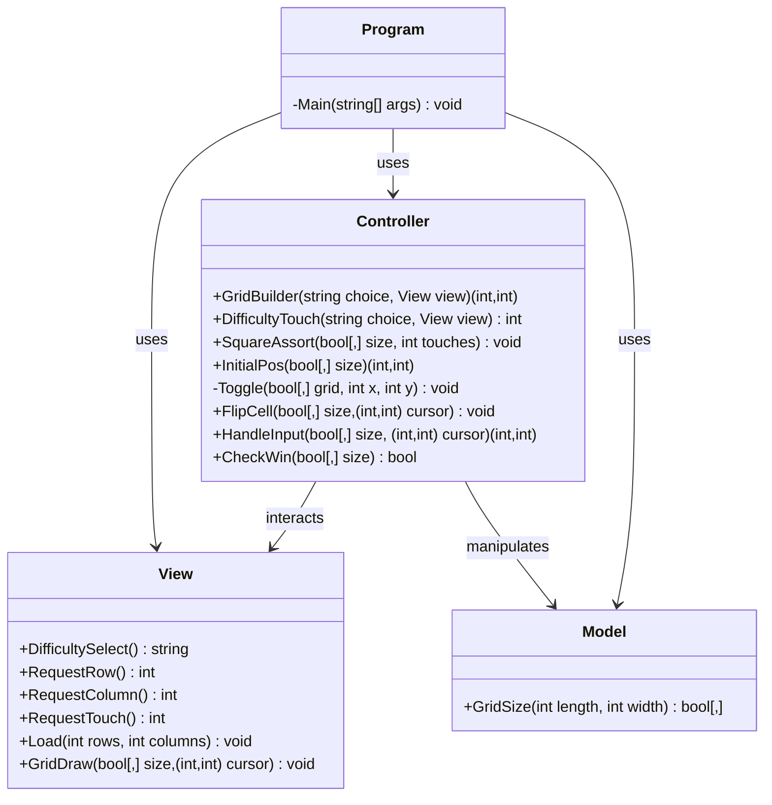

# Projeto-Final-LP1: Blackout

### Grupo de projeto:
#### Samuel Esteves - a22407214

-Código principal em Program.cs

-Código principal em Model.cs

-Código principal em View.cs

-Código principal em Controller.cs

-Setup Git
#### Miguel Martins - a22504050

-Documentação XML em todos os ficheiros

-Documentação no README.md

-Implemented Gitignore

---
### Repositório Git: https://github.com/whamslambamsam/Projeto-Final-LP1
---
### Arquitetura da Solução e Algoritmos utilizados

O projeto usa arquitetura baseada no modelo MVC(Model-View-Controller).

Program -> Controla o fluxo principal da projeto, inicializa os objetos, liga os componentes MVC, mantem o loop principal do jogo, seleção de dificuldade, criação da grid, atualização da interface e verificação de vitória.

Model -> Responsável pelos dados do projeto: criação da matriz bidimensional e armazenamento lógico da grid.

View -> Responsável pela interação com o utilizador: menus, inputs, output visual, desenho da grid, o cursor e animações de loading.

Controller -> Responsável pela lógica de decisão: interpreta a dificuldade, movimentação do cursor, ativação/desativação de células, randomização inicial, validação de vitória, processamento de inputs e faz a ligação entre View e Model.

    Fluxo da Aplicação

    Utilizador

    ↓

    View

    ↓

    Controller

    ↓

    Model

#### Algoritmos:

Seleção por decisão: presente em GridBuilder em Controller.cs

            return choice switch
            {
                "[green]Easy[/]" => (3, 3),
                "[yellow]Medium[/]" => (5, 5),
                "[red]Hard[/]" => (8, 8),
                "Custom" => (view.RequestRow(), view.RequestColumn()),
            };

Criar uma matriz bidimensional: Model.cs, linha 30, 

        bool[,] grid = new bool [lenght, width]

Desenho da grid: em GridDraw no View.cs 

        for (int x = 0; x < length; x++)
            {
                for (int y = 0; y < width; y++)
                {
                        Console.Write(blank + " ");
                }

                Console.WriteLine();
            }

Randomização de Células: em SquareSort no Controller.cs

    Random rng = new Random();

    int randCellX = rng.Next(length);
    int randCellY = rng.Next(width);

Algoritmo de Toggle: em Toggle e FlipCell no Controller.cs

        void Toggle(bool[,] grid, int x, int y)
        {
            grid[x, y] = !grid[x, y];
        }

---
### Diagrama UML de Classes

---
### Referências e bibliotecas utilizadas
Biblioteca usada: Spectre.Console

Em Program.cs: (Main) While loop e HandleInput foram debugged com a ajuda de IA.

Em View.cs: (GridDraw) IA foi usada para saber como ler valores nas grids e saber como "desenhar" grids.

Em Model.cs: (GridSize) Foi usado IA para perceber como é que se poderia fazer as grids.

Em Controller.cs: (GridBuilder) Foi usada IA para dar debug e concertar um erro com looping de inputs. A lógica e concepção foi feita por nós, apenas foi usada Inteligência Artificial para evitar o erro. (SquareAssort) IA foi usada para saber como ler valores nas grids e randomizar quais as celulas da grid ficam ativas. (Toggle) IA foi usada para perceber como mostrar uma celula desativada.

https://github.com/gitattributes/gitattributes/tree/master - Usado para configurar o .gitattributes.