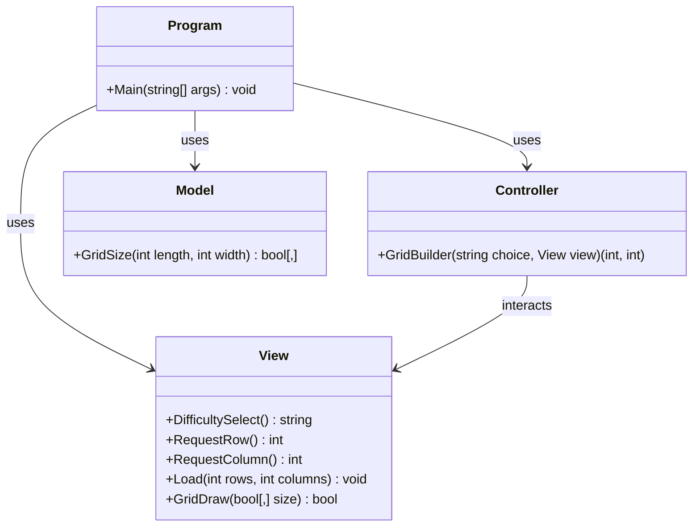

# Projeto-Final-LP1: Blackout

### Grupo de projeto:
#### Samuel Esteves - a22407214

-Código principal em Program.cs

-Código principal em Model.cs

-Código principal em View.cs

-Código principal em Controller.cs
#### Miguel Martins - a22504050

-Documentação XML em todos os ficheiros

-Documentação no README.md

---
### Repositório Git: https://github.com/whamslambamsam/Projeto-Final-LP1
---
### Arquitetura da Solução e Algoritmos utilizados

O projeto usa arquitetura baseada no modelo MVC(Model-View-Controller).

Program -> Controla o fluxo principal da projeto: cria os objetos, pede a dificuldade, gera a grid e desenha a interface.

Model -> Responsável pelos dados do projeto: criação da matriz bidimensional e armazenamento lógico da grid.

View -> Responsável pela interação com o utilizador: menus, inputs, output visual, desenho da grid e animações de loading

Controller -> Responsável pela lógica de decisão: interpreta a dificuldade escolhida, define dimensões da grid e faz a ligação entre View e Model.

#### Algoritmos:

Seleção por decisão: presente em GridBuilder em Controller.cs

            return choice switch
            {
                "[green]Easy[/]" => (3, 3),
                "[yellow]Medium[/]" => (5, 5),
                "[red]Hard[/]" => (8, 8),
                "Custom" => (view.RequestRow(), view.RequestColumn()),
            };

Criar uma matriz bidimensional: Model.cs, linha 30, 

        bool[,] grid = new bool [lenght, width]

Desenho da grid: em GridDraw no View.cs 

        for (int x = 0; x < length; x++)
            {
                for (int y = 0; y < width; y++)
                {
                        Console.Write(blank + " ");
                }

                Console.WriteLine();
            }

---
### Diagrama UML de Classes

---
### Referências e bibliotecas utilizadas
Biblioteca usada: Spectre.Console